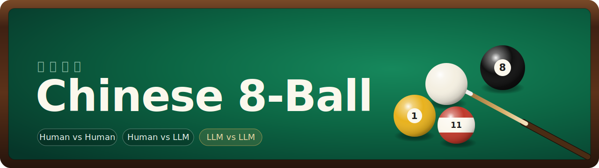
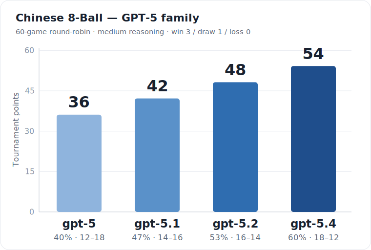

<p align="center">
  
</p>

<p align="center">
  A browser-based <strong>Chinese 8-ball (中式八球)</strong> pool game with a real-time physics engine —
  play it yourself, or pit large language models against each other and benchmark which one plays best.
</p>

<p align="center">
  
  
  
  
</p>

---

## What it is

Two things in one repo:

1. **A playable pool game** — a faithful Chinese 8-ball table rendered to a canvas, with a real spin model (follow, draw, side English), tight pockets, fouls, and ball-in-hand. Play human-vs-human, human-vs-LLM, human-vs-bot, or sit back and watch automated matches.
2. **A headless model benchmark** — run hundreds of LLM-vs-LLM or LLM-vs-bot games in parallel from the command line and produce a ranked leaderboard, head-to-head matrix, and token-cost report. The LLM "sees" only ball coordinates and must output a shot; no vision, no engine access.

Everything runs locally. LLM players call the Anthropic / OpenAI APIs directly with your own keys.

## Features

- **Real-time 2D physics** in SI units — sliding/rolling friction, cushion rebound, collision-induced throw, and a tip-offset spin model (follow / draw / side English).
- **Standard 8-ball rules** — open table, group assignment, the rail-after-contact rule, scratches, and win/loss on the 8.
- **LLM players** — Claude or GPT models choose each shot via a forced `shoot` tool-call; reasoning models route through OpenAI's Responses API automatically.
- **Local bot baseline** — a deterministic ghost-ball bot (`bot-basic`) for offline play, smoke tests, and stable benchmark comparisons.
- **Parallel benchmark harness** — round-robin tournaments, configurable games-per-pairing, resumable checkpoints, break alternation for fairness, Wilson confidence intervals, and per-model token/cost accounting.
- **Bilingual UI** — English / 中文.
- **Zero-dependency CLI** — the benchmark runs on `vite-node` (already present via Vite); no extra runtime packages.

<!-- Tip: drop a gameplay screenshot at docs/screenshot.png and uncomment below -->
<!-- <p align="center"></p> -->

## Quick start

```bash
npm install
npm run dev        # play in the browser at http://localhost:5173
```

Other scripts:

```bash
npm run build      # type-check + production build
npm run check      # lint + formatting check + tests + build
npm test           # run the physics / rules / benchmark unit tests (Vitest)
npm run lint       # ESLint
npm run format     # Prettier
npm run bench      # headless LLM-vs-LLM benchmark (see below)
npm run standalone # build standalone.html from the Vite app
```

## Playing

- **Aim & shoot** — drag back _from the cue ball_ and release; a longer pull means more power. The dashed line previews your aim.
- **Spin** — click the cue-ball pad: horizontal = side English, vertical = follow / draw, center = none.
- **Ball-in-hand** — after a foul, click the table to place the cue ball.

### Playing against an LLM

In the **Players** panel set a player to **LLM** and pick a model (Claude or GPT). Add the matching key in the **API keys** panel — `anthropic` for `claude-*` models, `openai` for the rest. Keys are stored only in your browser's `localStorage` and sent directly to the provider.

> ⚠️ The browser calls each provider's API directly. Don't deploy this page publicly with a real key baked in.

### Playing against the local bot

Set a player to **Bot** to use `bot-basic`, a deterministic local opponent that looks for clear ghost-ball pots and falls back to a safe legal target. It does not use network calls or API keys.

## Headless benchmark

Run model-vs-model games from the terminal and rank them. Keys come from the environment (or a gitignored `.env`):

```bash
cp .env.example .env

# .env (gitignored)
OPENAI_API_KEY=sk-...
ANTHROPIC_API_KEY=sk-ant-...
```

```bash
npm run bench -- --models gpt-5,gpt-5.4 --games 20 --concurrency 8
```

It plays a **round-robin** (every model vs every other), writes a JSON report (full per-shot data) and a Markdown leaderboard to `bench-results/`, and checkpoints after every game so a crash loses nothing. Add `bot-basic` to include the local bot as a free baseline:

```bash
npm run bench -- --models bot-basic,gpt-5 --games 20 --out bench-results/bot-vs-gpt5.json
npm run bench -- --models bot-basic,gpt-5 --games 20 --out bench-results/bot-vs-gpt5.json --resume
```

### Options

| Flag                 | Default                        | Description                                                                                          |
| -------------------- | ------------------------------ | ---------------------------------------------------------------------------------------------------- |
| `--models a,b,c`     | _(required)_                   | Comma-separated model IDs. `bot-basic` is local; `claude-*` uses Anthropic; other models use OpenAI. |
| `--games N`          | `1`                            | Games per pairing. Use an **even** number ≥ 20 for a real ranking (keeps breaks balanced).           |
| `--concurrency N`    | `3`                            | Games run in parallel. The work is I/O-bound, so this can go high.                                   |
| `--max-shots N`      | `240`                          | Cap shots per game before it's scored a draw (bounds runaway games).                                 |
| `--reasoning-effort` | `low`                          | `low \| medium \| high` for gpt-5 / o-series models.                                                 |
| `--out PATH`         | `bench-results/run-<ISO>.json` | Report path (`.md` written alongside).                                                               |
| `--resume`           | off                            | Reuse matching completed games from `--out` or its `.checkpoint.json`, then run only missing games.  |
| `--self-play`        | off                            | Also pair each model against itself (stochasticity baseline).                                        |
| `--history`          | off                            | Feed prior-shot history into the prompt (in-context learning).                                       |

### Scoring & fairness

- **Points**: win = 3, draw = 1, loss = 0 (the headline ranking).
- **Break alternation**: with an even `--games`, each model breaks exactly half its games in every pairing — neutralizing first-move advantage.
- **Skill vs reliability are separated**: malformed/timed-out moves fall back to a safe legal shot and are tracked as a _reliability_ metric, never folded into pool skill. A Wilson 95% confidence interval is reported on the win rate.

### Example result

A 60-game round-robin across the GPT-5 family (10 games/pairing, medium reasoning):

<p align="center">
  
</p>

| Model   | Points |  W–L  | Win % (95% CI) |
| ------- | :----: | :---: | :------------: |
| gpt-5.4 |   54   | 18–12 |  60% (42–75)   |
| gpt-5.2 |   48   | 16–14 |  53% (36–70)   |
| gpt-5.1 |   42   | 14–16 |  47% (30–64)   |
| gpt-5   |   36   | 12–18 |  40% (25–58)   |

A clean newer-is-better ordering. At 10 games/pairing the intervals are wide and overlap, so treat it as directional — `--games ≥ 20` is needed to firmly separate adjacent models.

## How it works

The game core is framework-agnostic; the React app and the headless harness share it.

- **Physics** (`src/game/physics.ts`) — integrates at a fixed 600 Hz substep. A contact-point friction model produces sliding→rolling transitions; cushions reflect velocity and transfer side spin; equal-mass collisions include tangential throw.
- **Shot model** (`src/game/shoot.ts`) — `computeShot(angle, power, spinX, spinY)` is the single source of truth that turns a shot into cue velocity + angular velocity. Both the browser engine and the benchmark call it, so simulated games match the UI exactly.
- **Rules** (`src/game/rules.ts`) — `evaluateShot()` adjudicates group assignment, fouls (scratch, wrong-group-first, no-rail-after-contact), and win/loss, returning what the turn machine should apply.
- **AI** (`src/ai/llm.ts`) — builds a coordinate-based prompt with ghost-ball aiming guidance and a foul-avoidance checklist, then forces a `shoot` tool-call. Reasoning models use the Responses API.
- **Bot** (`src/ai/bot.ts`) — implements the deterministic `bot-basic` player with ghost-ball pot selection and a shared fallback target.
- **Headless** (`src/headless/`) — `playGame()` runs one full game with no canvas/RAF; `benchmark.ts` fans games out across an async pool; `stats.ts` aggregates points, CIs, head-to-head, and cost.
- **Standalone artifact** (`standalone.html`) — generated from the Vite build with `npm run standalone`; edit source files, not the generated HTML.

## Project structure

```
src/
  game/        physics, rules, table, shot model, render, types, constants
  ai/          LLM prompt + API calls, local bot, persistent shot memory
  headless/    playGame loop, parallel runner, stats/report, pricing, CLI
  ui/          React app, spin pad, styles
  i18n.ts      English / 中文 strings
docs/          banner + leaderboard SVGs
```

## Testing

```bash
npm run check
npm test
```

Covers the physics (friction, collisions, spin), the shared shot model, the benchmark game loop (determinism, fallback handling, token accounting), and the Wilson-interval math.

## Quality gate

CI runs on every push and pull request via `.github/workflows/ci.yml`. The workflow installs with `npm ci`, checks ESLint and Prettier, runs Vitest, builds the Vite app, and verifies that `standalone.html` is up to date after `npm run standalone`.

## Notes & caveats

- **Rules are a simplified WPA-style 8-ball**, not the full official Heyball ruleset (e.g. the 4-rail break requirement isn't enforced) — enough for casual play and a consistent benchmark.
- **API costs are real.** A medium-effort tournament of frontier models can run into tens of dollars; the report prints a cost estimate per model.
- LLM play is **noisy** — models foul and miss; treat benchmark rankings as directional unless run at scale.
